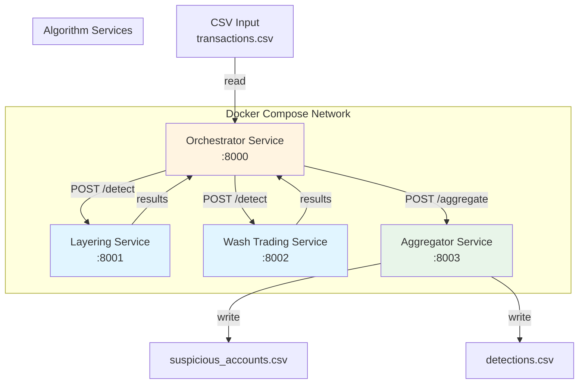

# Layering Detection Analytics

Python-based batch analytics that scans intraday transactions data (`input/transactions.csv`) to detect suspicious manipulation patterns (layering and wash trading) and produces:

- `output/suspicious_accounts.csv` – one row per detected suspicious sequence (see [Output Format](#output-format) below).
- `logs/detections.csv` – per-sequence detection logs (account, product, sequence of order timestamps, and duration in seconds), with columns:
  - `account_id`
  - `product_id`
  - `order_timestamps`
  - `duration_seconds`

The implementation follows the PRD in `assignment` and the specs in `specs/`.

---

## Quick Start (5 minutes)

### Option 1: Microservices (Recommended for Production)

**Prerequisites:** Docker and Docker Compose

```powershell
# Start all services
docker-compose up --build

# In another terminal, trigger pipeline
curl -X POST http://localhost:8000/orchestrate -H "Content-Type: application/json" -d '{"input_file": "input/transactions.csv"}'

# Check outputs
ls output/suspicious_accounts.csv
ls logs/detections.csv

# Stop services
docker-compose down
```

### Option 2: Monolithic (Development/Testing)

**Prerequisites:** Python 3.11+

```powershell
py -3.11 -m venv .venv
.\.venv\Scripts\Activate.ps1
python -m pip install --upgrade pip
python -m pip install .
python main.py
```

---

## Architecture

The system uses a **microservices architecture** with independent services communicating via REST APIs. Each service runs in its own Docker container, enabling independent scaling, deployment, and fault isolation.

### System Flow

```
CSV Input → Orchestrator → [Algorithm Services (parallel)] → Aggregator → Output
```

### Architecture Diagram



### Services

**1. Orchestrator Service** (`services/orchestrator-service/`)
- **Port:** 8000
- **Responsibilities:** Read CSV, generate request IDs, call algorithm services in parallel, handle retries, forward to aggregator
- **Endpoints:** `POST /orchestrate`, `GET /health`
- **Features:** Retry logic with exponential backoff, fault isolation, completion tracking

**2. Layering Service** (`services/layering-service/`)
- **Port:** 8001
- **Responsibilities:** Run layering detection algorithm
- **Endpoints:** `POST /detect`, `GET /health`
- **Features:** Idempotent operations, result caching

**3. Wash Trading Service** (`services/wash-trading-service/`)
- **Port:** 8002
- **Responsibilities:** Run wash trading detection algorithm
- **Endpoints:** `POST /detect`, `GET /health`
- **Features:** Idempotent operations, result caching

**4. Aggregator Service** (`services/aggregator-service/`)
- **Port:** 8003
- **Responsibilities:** Validate completion, merge results, write CSV files
- **Endpoints:** `POST /aggregate`, `GET /health`
- **Features:** Completion validation, result deduplication, CSV writing

### Design Principles

- **Separation of Concerns:** Each service has a single responsibility
- **Fault Isolation:** Service failures don't cascade
- **Independent Scaling:** Scale algorithm services independently based on load
- **Parallel Execution:** Algorithm services run concurrently
- **Idempotency:** Retries don't cause duplicate processing
- **Type Safety:** Strict type hints with Pydantic validation at service boundaries

---

## Migration from Monolith

The system migrated from a monolithic architecture to microservices to address scalability, fault isolation, and independent deployment needs.

### Migration Status

- ✅ Microservices architecture implemented
- ✅ All services containerized
- ✅ Docker Compose orchestration configured
- ✅ Backward compatibility maintained (monolithic mode still available)

### When to Use Each Architecture

**Microservices (Recommended):**
- Production deployments requiring scalability
- Independent algorithm scaling needs
- Fault isolation requirements
- High availability requirements
- Parallel algorithm execution

**Monolithic (Still Available):**
- Development/testing (simpler setup)
- Small-scale deployments
- Single-machine execution
- Rapid prototyping

### Performance Comparison

| Aspect | Monolithic | Microservices |
|--------|-----------|---------------|
| Network Latency | Zero (in-process) | ~10-50ms per service call |
| Execution | Sequential (sum of times) | Parallel (max of times) |
| Scaling | Single point | Independent per service |
| Fault Isolation | None (single failure point) | Per-service isolation |
| **Net Benefit** | Simpler, faster for small workloads | Better for production, parallelization typically outweighs network overhead |

### Migration Path

The migration was completed in phases:

1. **Phase 1:** Extracted algorithm services (Layering, Wash Trading)
2. **Phase 2:** Implemented orchestrator service with retry logic
3. **Phase 3:** Implemented aggregator service for result validation and merging
4. **Phase 4:** Configured Docker Compose for full pipeline orchestration

**Backward Compatibility:** The monolithic `main.py` CLI remains functional, calling `layering_detection.orchestrator.run_pipeline()` directly. Both architectures produce identical output formats.

---

## Project Structure

```
Layering-Detection-Analytics/
├── services/                    # Microservices
│   ├── orchestrator-service/   # Pipeline coordination
│   ├── layering-service/       # Layering detection algorithm
│   ├── wash-trading-service/   # Wash trading detection algorithm
│   ├── aggregator-service/     # Result aggregation and CSV writing
│   └── shared/                 # Shared utilities (API models, converters, logging)
├── src/layering_detection/      # Core domain models and algorithms
│   ├── models.py               # Domain models (TransactionEvent, SuspiciousSequence)
│   ├── algorithms/             # Detection algorithms
│   ├── detectors/              # Algorithm implementations
│   └── utils/                  # Utilities (I/O, logging, security)
├── input/transactions.csv      # Sample input file
├── output/                     # Output directory (created at runtime)
├── logs/                       # Logs directory (created at runtime)
├── tests/                      # pytest-based unit, integration, and e2e tests
├── specs/                      # Architecture and feature specifications
├── docker-compose.yml          # Docker Compose configuration
├── main.py                     # Monolithic CLI entry point (backward compatibility)
└── pyproject.toml              # Python package configuration
```

---

## Requirements

- Python **3.11** (for monolithic mode)
- Docker and Docker Compose (for microservices mode)
- `pip` (up-to-date inside virtual environment)

---

## Local Setup and Installation

### Microservices Setup

**Using Docker Compose (Recommended):**

```powershell
# Build and start all services
docker-compose up --build

# Services will be available at:
# - Orchestrator: http://localhost:8000
# - Layering: http://localhost:8001
# - Wash Trading: http://localhost:8002
# - Aggregator: http://localhost:8003

# Check health
curl http://localhost:8000/health
curl http://localhost:8001/health
curl http://localhost:8002/health
curl http://localhost:8003/health
```

**Running Individual Services Locally:**

Each service can be run independently for development:

```powershell
# Layering Service
cd services/layering-service
python -m pip install -r requirements.txt
uvicorn main:app --port 8001

# Wash Trading Service
cd services/wash-trading-service
python -m pip install -r requirements.txt
uvicorn main:app --port 8002

# Aggregator Service
cd services/aggregator-service
python -m pip install -r requirements.txt
uvicorn main:app --port 8003

# Orchestrator Service
cd services/orchestrator-service
python -m pip install -r requirements.txt
uvicorn main:app --port 8000
```

### Monolithic Setup

From the project root:

```powershell
py -3.11 -m venv .venv
.\.venv\Scripts\Activate.ps1
python -m pip install --upgrade pip
python -m pip install .
```

Ensure the input file is present at:
- `input\transactions.csv`

---

## Running the Solution

### Microservices Mode (Recommended)

**Using Docker Compose:**

```powershell
# Start all services
docker-compose up --build

# Trigger pipeline execution
curl -X POST http://localhost:8000/orchestrate `
  -H "Content-Type: application/json" `
  -d '{\"input_file\": \"input/transactions.csv\"}'

# Or use PowerShell's Invoke-RestMethod
$body = @{ input_file = "input/transactions.csv" } | ConvertTo-Json
Invoke-RestMethod -Uri http://localhost:8000/orchestrate -Method POST -Body $body -ContentType "application/json"
```

**Using Python Client:**

```python
import httpx

response = httpx.post(
    "http://localhost:8000/orchestrate",
    json={"input_file": "input/transactions.csv"}
)
print(response.json())
```

**Outputs:**
- `output/suspicious_accounts.csv`
- `logs/detections.csv`

### Monolithic Mode (Backward Compatibility)

With the virtual environment activated:

```powershell
python main.py
```

Or with custom paths:

```powershell
python main.py input/transactions.csv output logs
```

**Programmatic:**

```powershell
python -c "from pathlib import Path; from layering_detection.orchestrator import run_pipeline; run_pipeline(Path('input/transactions.csv'), Path('output'), Path('logs'))"
```

---

## Running Tests

With the virtual environment activated:

```powershell
python -m pip install pytest pytest-asyncio
pytest
```

**Test Structure:**
- `tests/unit/` – Unit tests for individual components
- `tests/integration/` – Integration tests for service interactions
- `tests/e2e/` – End-to-end tests with Docker Compose

**Run specific test suites:**

```powershell
pytest tests/unit/                    # Unit tests only
pytest tests/integration/             # Integration tests only
pytest tests/e2e/                     # End-to-end tests only
pytest tests/unit/test_orchestrator_validation.py  # Specific test file
```

---

## Running via Docker

### Microservices (Docker Compose)

Build and run all services:

```powershell
docker-compose up --build
```

This starts all four services with:
- Health checks configured
- Volumes mounted (`input/`, `output/`, `logs/`)
- Network configured for inter-service communication
- Automatic restarts on failure

**Stop services:**

```powershell
docker-compose down
```

**View logs:**

```powershell
docker-compose logs -f orchestrator-service
docker-compose logs -f layering-service
docker-compose logs -f wash-trading-service
docker-compose logs -f aggregator-service
```

### Monolithic (Single Container)

Build the monolithic Docker image:

```powershell
docker build -t layering-detection:0.1.0 -t layering-detection:latest .
```

Run the container:

```powershell
docker run --rm `
  -v ${PWD}\input:/app/input `
  -v ${PWD}\output:/app/output `
  -v ${PWD}\logs:/app/logs `
  layering-detection:0.1.0
```

---

## Output Format

### `suspicious_accounts.csv`

The output CSV contains one row per detected suspicious sequence. The schema includes:

**Required Columns (all detection types):**
- `account_id`: Suspicious account identifier
- `product_id`: Product where activity was detected
- `total_buy_qty`: Total BUY quantity during the pattern window (integer)
- `total_sell_qty`: Total SELL quantity during the pattern window (integer)
- `num_cancelled_orders`: Count of cancelled orders in the sequence
  - For **LAYERING**: Actual count of cancelled orders (≥3)
  - For **WASH_TRADING**: Always 0 (not applicable to wash trading)
- `detected_timestamp`: ISO datetime when detection occurred
  - For **LAYERING**: Timestamp of the opposite-side trade that completes the pattern
  - For **WASH_TRADING**: Timestamp of the last trade in the 30-minute window

**Additional Columns (for multi-algorithm support):**
- `detection_type`: Type of detection pattern (`"LAYERING"` or `"WASH_TRADING"`)

**Wash Trading Specific Columns (empty for LAYERING):**
- `alternation_percentage`: Percentage of side switches between consecutive trades (decimal, 2 places)
  - Empty string (`""`) for LAYERING detections
  - Only populated for WASH_TRADING when ≥60% alternation is detected
- `price_change_percentage`: Price change during the detection window (decimal, 2 places)
  - Empty string (`""`) if:
    - Detection type is LAYERING (not applicable)
    - Price change is <1% (optional bonus threshold not met)
  - Only populated for WASH_TRADING when price change ≥1% (optional bonus criterion)

**Example Output:**
```csv
account_id,product_id,total_buy_qty,total_sell_qty,num_cancelled_orders,detected_timestamp,detection_type,alternation_percentage,price_change_percentage
ACC001,IBM,3000,2000,3,2025-01-15T10:30:00Z,LAYERING,,
ACC002,GOOG,12000,12000,0,2025-01-15T11:00:00Z,WASH_TRADING,80.00,1.25
```

**Note:** The assignment specification defines 6 core columns. The additional columns (`detection_type`, `alternation_percentage`, `price_change_percentage`) are included to support wash trading detection, which is also specified in the assignment requirements.

---

## Outputs Delivered

After a successful run (microservices or monolithic), you should have:

- `output\` folder containing:
  - `suspicious_accounts.csv` (see [Output Format](#output-format) above)
- `logs\` folder containing:
  - `detections.csv`

You can package these along with a screenshot of the running Docker container and this project as the final delivery.

---

## Assumptions

- **Time semantics**:
  - All timestamps in `transactions.csv` are UTC ISO datetimes with a trailing `Z` (e.g. `2025-10-26T10:21:20Z`).
  - Detection windows (10s for orders, 5s for cancels, 2s for opposite trades) are evaluated using these parsed datetimes.
- **Order identity**:
  - Input rows do not contain explicit order IDs; we approximate "orders cancelled before execution" purely from event type, side, and timing.
  - Partially executed orders are not modeled explicitly; we rely on the simplified PRD and timing-only interpretation.
- **Input quality**:
  - Invalid rows (bad types, invalid enums, missing fields) are rare and can be skipped with a warning; they do not abort the run.
  - `account_id` and `product_id` come from trusted upstream systems and are not attacker-controlled in typical deployments.
- **Scope of detection**:
  - Only the 3-step simplified layering pattern from the PRD is implemented; no additional market-abuse scenarios are covered.
  - Each order is intended to participate in at most one detected sequence for a given `(account_id, product_id)` group.

---

## Possible Improvements / Extensions

- **Richer order modeling**:
  - Introduce explicit order IDs and execution quantities if the upstream data supports them, to distinguish fully/partially executed vs. purely cancelled orders more accurately.
  - Track per-order lifecycle to identify more complex behaviors (e.g., layered spoofing with partial fills).
- **Detection engine flexibility**:
  - Make timing thresholds (10s/5s/2s) configurable via a simple config file or environment variables.
  - Support additional patterns (e.g., multi-level price layering, cross-product patterns) behind clear feature flags.
- **Performance & scalability**:
  - For very large `transactions.csv` files, move from in-memory lists to streaming/grouped processing or chunked reads.
  - Consider parallelizing detection across accounts/products if/when CPU-bound.
  - Add horizontal scaling support for algorithm services (load balancing).
- **Operational hardening**:
  - Replace basic `logging` setup with a configurable logging configuration (JSON logs, log rotation, different sinks).
  - Add more robust error reporting for malformed inputs (summary statistics, counts per error type).
  - Add distributed tracing (OpenTelemetry) for request tracking across services.
- **Security & privacy**:
  - Expose a configuration switch to always pseudonymize account IDs in logs (and possibly outputs) for environments with stricter privacy requirements.
  - Extend CSV sanitization to any additional free-text fields if the schema grows in the future.
  - Add authentication/authorization for service endpoints in production.

---

## API Reference

All services expose REST APIs with JSON request/response bodies. All endpoints use standard HTTP status codes.

### Orchestrator Service (`http://localhost:8000`)

**`POST /orchestrate`** – Trigger full pipeline execution

**Request:**
```json
{
  "input_file": "input/transactions.csv"
}
```

**Response:**
```json
{
  "request_id": "550e8400-e29b-41d4-a716-446655440000",
  "status": "completed",
  "event_count": 1000,
  "aggregated_count": 5,
  "failed_services": [],
  "error": null
}
```

**`GET /health`** – Health check

**Response:**
```json
{
  "status": "healthy",
  "service": "orchestrator-service"
}
```

**`GET /`** – Service information

**Response:**
```json
{
  "service": "orchestrator-service",
  "version": "1.0.0",
  "status": "running",
  "input_dir": "/app/input",
  "layering_service_url": "http://layering-service:8001",
  "wash_trading_service_url": "http://wash-trading-service:8002",
  "aggregator_service_url": "http://aggregator-service:8003",
  "max_retries": 3,
  "timeout_seconds": 30
}
```

### Algorithm Services (Layering `:8001`, Wash Trading `:8002`)

**`POST /detect`** – Run detection algorithm

**Request:**
```json
{
  "request_id": "550e8400-e29b-41d4-a716-446655440000",
  "event_fingerprint": "abc123...",
  "events": [
    {
      "timestamp": "2025-01-15T10:30:00Z",
      "account_id": "ACC001",
      "product_id": "IBM",
      "side": "BUY",
      "price": "100.50",
      "quantity": 1000,
      "event_type": "ORDER_PLACED"
    }
  ]
}
```

**Response:**
```json
{
  "request_id": "550e8400-e29b-41d4-a716-446655440000",
  "service_name": "layering",
  "status": "success",
  "results": [
    {
      "account_id": "ACC001",
      "product_id": "IBM",
      "start_timestamp": "2025-01-15T10:30:00Z",
      "end_timestamp": "2025-01-15T10:30:05Z",
      "total_buy_qty": 3000,
      "total_sell_qty": 2000,
      "detection_type": "LAYERING",
      "num_cancelled_orders": 3
    }
  ],
  "error": null
}
```

**`GET /health`** – Health check

**Response:**
```json
{
  "status": "healthy",
  "service": "layering-service"
}
```

### Aggregator Service (`http://localhost:8003`)

**`POST /aggregate`** – Aggregate and write results

**Request:**
```json
{
  "request_id": "550e8400-e29b-41d4-a716-446655440000",
  "expected_services": ["layering", "wash_trading"],
  "results": [
    {
      "request_id": "550e8400-e29b-41d4-a716-446655440000",
      "service_name": "layering",
      "status": "success",
      "results": [...],
      "error": null
    }
  ]
}
```

**Response:**
```json
{
  "status": "completed",
  "merged_count": 5,
  "failed_services": []
}
```

**`GET /health`** – Health check

**Response:**
```json
{
  "status": "healthy",
  "service": "aggregator-service"
}
```

---

## Configuration

All services use environment variables for configuration. Set these in `docker-compose.yml` or as container environment variables.

### Orchestrator Service

| Variable | Default | Description |
|----------|---------|-------------|
| `PORT` | `8000` | Service port |
| `INPUT_DIR` | `/app/input` | Directory for input CSV files |
| `LAYERING_SERVICE_URL` | `http://layering-service:8001` | Layering service URL |
| `WASH_TRADING_SERVICE_URL` | `http://wash-trading-service:8002` | Wash trading service URL |
| `AGGREGATOR_SERVICE_URL` | `http://aggregator-service:8003` | Aggregator service URL |
| `MAX_RETRIES` | `3` | Maximum retry attempts per algorithm call |
| `ALGORITHM_TIMEOUT_SECONDS` | `30` | Timeout per algorithm service call |
| `LOG_LEVEL` | `INFO` | Logging level (DEBUG, INFO, WARNING, ERROR) |

### Algorithm Services (Layering, Wash Trading)

| Variable | Default | Description |
|----------|---------|-------------|
| `PORT` | `8001` / `8002` | Service port |
| `LOG_LEVEL` | `INFO` | Logging level |

### Aggregator Service

| Variable | Default | Description |
|----------|---------|-------------|
| `PORT` | `8003` | Service port |
| `OUTPUT_DIR` | `/app/output` | Directory for output CSV files |
| `LOGS_DIR` | `/app/logs` | Directory for log CSV files |
| `VALIDATION_STRICT` | `true` | Fail fast on validation errors |
| `ALLOW_PARTIAL_RESULTS` | `false` | Allow merging if some services failed |
| `LOG_LEVEL` | `INFO` | Logging level |

**Example Docker Compose override:**

```yaml
services:
  orchestrator-service:
    environment:
      - MAX_RETRIES=5
      - ALGORITHM_TIMEOUT_SECONDS=60
      - LOG_LEVEL=DEBUG
```

---

## Troubleshooting

### Services Won't Start

**Problem:** Docker Compose fails to start services

**Solutions:**
- Check port availability: `netstat -ano | findstr :8000`
- Verify Docker is running: `docker ps`
- Check logs: `docker-compose logs orchestrator-service`
- Rebuild images: `docker-compose build --no-cache`

### Pipeline Fails with "Missing Services"

**Problem:** Orchestrator reports missing or incomplete services

**Solutions:**
- Verify all services are healthy: `curl http://localhost:8001/health`
- Check service logs: `docker-compose logs layering-service`
- Verify network connectivity: Services must be on same Docker network
- Check `EXPECTED_SERVICES` matches running services

### Algorithm Service Timeouts

**Problem:** Algorithm services timeout during detection

**Solutions:**
- Increase timeout: Set `ALGORITHM_TIMEOUT_SECONDS=60` in orchestrator config
- Check service resources: `docker stats`
- Verify input file size: Large files may need streaming
- Check algorithm service logs for errors

### Output Files Not Created

**Problem:** `suspicious_accounts.csv` or `detections.csv` missing

**Solutions:**
- Verify aggregator service completed: Check logs `docker-compose logs aggregator-service`
- Check volume mounts: `docker-compose config` shows volume configuration
- Verify write permissions: `ls -la output/` (Linux) or check directory permissions (Windows)
- Check aggregator validation: Look for "validation_failed" in response

### Retry Logic Not Working

**Problem:** Services fail immediately without retries

**Solutions:**
- Verify `MAX_RETRIES` is set: Check orchestrator config
- Check retry conditions: Only transient errors (5xx, timeouts) trigger retries
- Review logs: Look for "Retrying" messages in orchestrator logs
- Verify exponential backoff: Check delay between retries (2^attempt seconds)

### Health Checks Failing

**Problem:** Docker health checks report unhealthy

**Solutions:**
- Check service is listening: `curl http://localhost:8000/health`
- Verify health check command: Check `docker-compose.yml` healthcheck configuration
- Check service startup time: Increase `start_period` if service needs more time
- Review service logs for startup errors

---

## Monitoring and Observability

### Health Checks

All services expose `/health` endpoints for health monitoring:

```powershell
# Check all services
curl http://localhost:8000/health
curl http://localhost:8001/health
curl http://localhost:8002/health
curl http://localhost:8003/health
```

### Logging

Services log to stdout/stderr (Docker-friendly). View logs:

```powershell
# All services
docker-compose logs -f

# Specific service
docker-compose logs -f orchestrator-service
docker-compose logs -f layering-service
docker-compose logs -f wash-trading-service
docker-compose logs -f aggregator-service

# Last 100 lines
docker-compose logs --tail=100 orchestrator-service

# Since timestamp
docker-compose logs --since 10m orchestrator-service
```

**Log Format:**
- Structured logging with service name and request_id
- Log levels: DEBUG, INFO, WARNING, ERROR
- Request tracing via `request_id` across services

### Metrics (Future Enhancement)

Planned metrics for production:
- Request count per service
- Request latency (p50, p95, p99)
- Error rate per service
- Retry count distribution
- Cache hit/miss ratio

### Distributed Tracing (Future Enhancement)

Planned tracing support:
- OpenTelemetry integration
- Request ID propagation across services
- Trace visualization (Jaeger/Zipkin)

---

## Deployment

### Production Considerations

**Security:**
- Add authentication/authorization for service endpoints
- Use HTTPS/TLS for inter-service communication
- Restrict network access (firewall rules)
- Rotate secrets and API keys regularly
- Enable account ID pseudonymization in logs

**Scalability:**
- Scale algorithm services horizontally (load balancer)
- Use message queue (RabbitMQ/Kafka) for async processing
- Implement connection pooling for HTTP clients
- Add caching layer (Redis) for result deduplication
- Consider database for persistent result storage

**Reliability:**
- Configure service restart policies (`restart: unless-stopped`)
- Set resource limits (CPU, memory) per service
- Implement circuit breakers for service calls
- Add dead letter queues for failed requests
- Monitor service health with alerting

**Performance:**
- Use streaming for large CSV files (>1GB)
- Implement request batching for algorithm calls
- Add result pagination for large result sets
- Optimize Docker images (multi-stage builds)
- Use CDN for static assets (if applicable)

### Docker Compose Production Override

Create `docker-compose.prod.yml`:

```yaml
version: '3.8'

services:
  orchestrator-service:
    restart: unless-stopped
    deploy:
      resources:
        limits:
          cpus: '2'
          memory: 2G
        reservations:
          cpus: '1'
          memory: 1G
    environment:
      - LOG_LEVEL=WARNING
      - MAX_RETRIES=5
      - ALGORITHM_TIMEOUT_SECONDS=60

  layering-service:
    restart: unless-stopped
    deploy:
      replicas: 2
      resources:
        limits:
          cpus: '1'
          memory: 1G

  wash-trading-service:
    restart: unless-stopped
    deploy:
      replicas: 2
      resources:
        limits:
          cpus: '1'
          memory: 1G
```

**Deploy:**

```powershell
docker-compose -f docker-compose.yml -f docker-compose.prod.yml up -d
```

### Kubernetes Deployment (Future)

Planned Kubernetes manifests:
- Deployment manifests per service
- Service definitions for internal/external access
- ConfigMaps for configuration
- Secrets for sensitive data
- HorizontalPodAutoscaler for auto-scaling
- Ingress for external access

---

## Notes on Using Cursor for This Project

This repository was developed using the **Cursor** IDE with AI assistance wired into the project workspace. The AI assistant was configured to:

- Read and respect the specification files under `specs/` and the original `assignment` text.
- Make incremental code changes directly in `src/` and `tests/`, keeping the codebase always in a runnable state.
- Run semantic and grep-style searches across the workspace to understand and refactor code.
- Use **specialized agents** (e.g., `@agent.pm.md`, `@agent.architect.md`, `@agent.reviewer.md`, `@agent.tester.md`, `@agent.security.md`, `@agent.devops.md`, `@agent.docs.md`) for different tasks such as planning, architecture, code review, testing, security review, DevOps/Docker, and documentation.
