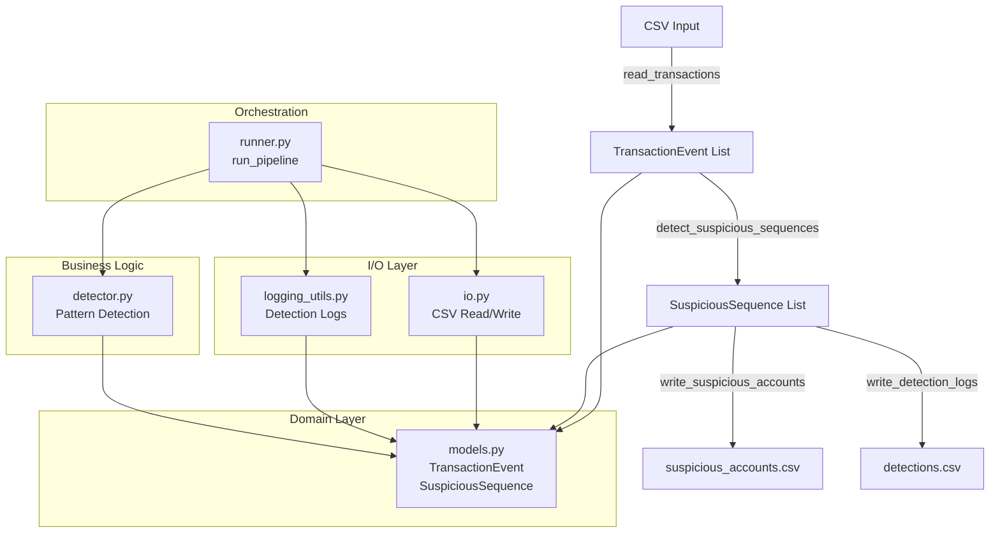

## Layering Detection Analytics

Python-based batch analytics that scans intraday transactions data (`input/transactions.csv`) to detect simplified layering manipulation patterns and produces:

- `output/suspicious_accounts.csv` – one row per detected suspicious layering sequence.
- `logs/detections.csv` – per-sequence detection logs (account, product, sequence of order timestamps, and duration in seconds), with columns:
  - `account_id`
  - `product_id`
  - `order_timestamps`
  - `duration_seconds`

The implementation follows the PRD in `assignment` and the specs in `specs/`.

---

## Project structure

- `src/layering_detection/`
  - `models.py` – domain models (`TransactionEvent`, `SuspiciousSequence`).
  - `io.py` – CSV reading (`transactions.csv`) and writing (`suspicious_accounts.csv`).
  - `detector.py` – core layering detection logic and aggregation.
  - `logging_utils.py` – writes detection log CSV (`logs/detections.csv`).
  - `security_utils.py` – CSV sanitization and optional account pseudonymization helpers.
  - `runner.py` – `run_pipeline(...)` orchestration (read → detect → write outputs/logs).
- `input/transactions.csv` – sample input file provided in the assignment.
- `output/` – output directory (created at runtime).
- `logs/` – logs directory (created at runtime).
- `tests/` – pytest-based unit and integration tests.
- `Dockerfile` – container image definition.
- `specs/` – derived requirements/feature/data/deployment specs.

---

## Architecture

The system follows a layered architecture separating domain models, I/O operations, business logic, and orchestration:



**Data Flow:**
1. **Input**: `io.py` reads CSV and parses into `TransactionEvent` domain objects
2. **Detection**: `detector.py` groups events by `(account_id, product_id)` and detects layering patterns
3. **Output**: Results written to CSV files via `io.py` (suspicious accounts) and `logging_utils.py` (detection logs)

**Design Principles:**
- **Separation of Concerns**: Domain models are framework-agnostic, I/O is isolated from business logic
- **Pure Functions**: Detection logic has no side effects, making it easily testable
- **Type Safety**: Strict type hints throughout using PEP-484
- **Minimal Dependencies**: Standard library only (no external frameworks)

---

## Requirements

- Python **3.11** (recommended via `py` launcher on Windows).
- `pip` (up-to-date inside the virtual environment).
- (Optional) Docker for containerized execution.

---

## Local setup and installation

From the project root (`Layering-Detection-Analytics`):

```powershell
py -3.11 -m venv .venv
.\.venv\Scripts\Activate.ps1
python -m pip install --upgrade pip
python -m pip install .
```

This installs the `layering_detection` package from `src/` into your virtual environment.

Ensure the input file is present at:

- `input\transactions.csv`

---

## Running the solution locally (end-to-end)

With the virtual environment activated and the package installed, run:

```powershell
python -c "from pathlib import Path; from layering_detection.runner import run_pipeline; run_pipeline(Path('input/transactions.csv'), Path('output'), Path('logs'))"
```

What this does:

- Reads `input/transactions.csv`.
- Runs the layering detection engine.
- Writes:
  - `output\suspicious_accounts.csv`
  - `logs\detections.csv`

You can open these CSV files in your editor or Excel to inspect the results.

---

## Running tests

With the virtual environment activated:

```powershell
python -m pip install pytest
pytest
```

This runs all unit and integration tests under `tests/`.

---

## Running via Docker

Build the Docker image from the project root with version tags:

```powershell
docker build -t layering-detection:0.1.0 -t layering-detection:latest .
```

Run the container, mounting `input/`, `output/`, and `logs/` from the host:

```powershell
docker run --rm `
  -v ${PWD}\input:/app/input `
  -v ${PWD}\output:/app/output `
  -v ${PWD}\logs:/app/logs `
  layering-detection:0.1.0
```

Or use the `latest` tag:

```powershell
docker run --rm `
  -v ${PWD}\input:/app/input `
  -v ${PWD}\output:/app/output `
  -v ${PWD}\logs:/app/logs `
  layering-detection:latest
```

Inside the container, the default command:

- Calls `run_pipeline("input/transactions.csv", "output", "logs")`.
- Produces `output/suspicious_accounts.csv` and `logs/detections.csv` on the host (through the mounted volumes).

---

## Outputs delivered (as per assignment)

After a successful run (local or Docker), you should have:

- `output\` folder containing:
  - `suspicious_accounts.csv`
- `logs\` folder containing:
  - `detections.csv`

You can package these along with a screenshot of the running Docker container and this project as the final delivery. 

---

## Assumptions

- **Time semantics**:
  - All timestamps in `transactions.csv` are UTC ISO datetimes with a trailing `Z` (e.g. `2025-10-26T10:21:20Z`).
  - Detection windows (10s for orders, 5s for cancels, 2s for opposite trades) are evaluated using these parsed datetimes.
- **Order identity**:
  - Input rows do not contain explicit order IDs; we approximate “orders cancelled before execution” purely from event type, side, and timing.
  - Partially executed orders are not modeled explicitly; we rely on the simplified PRD and timing-only interpretation.
- **Input quality**:
  - Invalid rows (bad types, invalid enums, missing fields) are rare and can be skipped with a warning; they do not abort the run.
  - `account_id` and `product_id` come from trusted upstream systems and are not attacker-controlled in typical deployments.
- **Scope of detection**:
  - Only the 3-step simplified layering pattern from the PRD is implemented; no additional market-abuse scenarios are covered.
  - Each order is intended to participate in at most one detected sequence for a given `(account_id, product_id)` group.

---

## Possible improvements / extensions

- **Richer order modeling**:
  - Introduce explicit order IDs and execution quantities if the upstream data supports them, to distinguish fully/partially executed vs. purely cancelled orders more accurately.
  - Track per-order lifecycle to identify more complex behaviors (e.g., layered spoofing with partial fills).
- **Detection engine flexibility**:
  - Make timing thresholds (10s/5s/2s) configurable via a simple config file or environment variables.
  - Support additional patterns (e.g., multi-level price layering, cross-product patterns) behind clear feature flags.
- **Performance & scalability**:
  - For very large `transactions.csv` files, move from in-memory lists to streaming/grouped processing or chunked reads.
  - Consider parallelizing detection across accounts/products if/when CPU-bound.
- **Operational hardening**:
  - Replace basic `logging` setup with a configurable logging configuration (JSON logs, log rotation, different sinks).
  - Add more robust error reporting for malformed inputs (summary statistics, counts per error type).
- **Security & privacy**:
  - Expose a configuration switch to always pseudonymize account IDs in logs (and possibly outputs) for environments with stricter privacy requirements.
  - Extend CSV sanitization to any additional free-text fields if the schema grows in the future.

---

## Notes on using Cursor for this project

- This repository was developed using the **Cursor** IDE with AI assistance wired into the project workspace.
- The AI assistant was configured to:
  - Read and respect the specification files under `specs/` and the original `assignment` text.
  - Make incremental code changes directly in `src/` and `tests/`, keeping the codebase always in a runnable state.
  - Run semantic and grep-style searches across the workspace to understand and refactor code.
  - Use **specialized agents** (e.g., `@agent.pm.md`, `@agent.architect.md`, `@agent.reviewer.md`, `@agent.tester.md`, `@agent.security.md`, `@agent.devops.md`, `@agent.docs.md`) for different tasks such as planning, architecture, code review, testing, security review, DevOps/Docker, and documentation.


