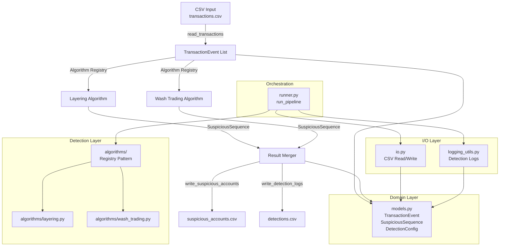

# Architecture: Layering Detection Analytics

## Overview

The system implements a batch analytics pipeline that detects suspicious trading patterns (layering and wash trading) in transaction data. The architecture follows a layered design with clear separation of concerns, enabling extensibility through a plugin-based algorithm registry.

## System Architecture

### High-Level Flow

```
CSV Input → Parse → Group → [Algorithm Registry] → Merge Results → Output
```

**Components:**
1. **I/O Layer**: CSV parsing and writing
2. **Domain Layer**: Immutable data models
3. **Detection Layer**: Algorithm registry with pluggable detection algorithms
4. **Orchestration Layer**: Pipeline coordination

### Component Diagram



## Core Components

### 1. Domain Models (`models.py`)

**TransactionEvent**: Immutable dataclass representing a single transaction event
- `timestamp`: ISO datetime
- `account_id`, `product_id`: Identifiers
- `side`: BUY or SELL
- `price`, `quantity`: Trade details
- `event_type`: ORDER_PLACED, ORDER_CANCELLED, or TRADE_EXECUTED

**SuspiciousSequence**: Immutable dataclass representing a detected pattern
- Core fields: `account_id`, `product_id`, `total_buy_qty`, `total_sell_qty`, `num_cancelled_orders`, `detected_timestamp`
- Algorithm-specific: `detection_type`, `alternation_percentage`, `price_change_percentage`

**DetectionConfig**: Configuration for detection timing windows
- `orders_window`: Time window for order grouping (default: 10s)
- `cancel_window`: Time window for cancellations (default: 5s)
- `opposite_trade_window`: Time window for opposite trades (default: 2s)

### 2. Algorithm Registry Pattern (`algorithms/`)

**Purpose**: Enable plugin-based algorithm addition without modifying core code.

**Components:**
- `base.py`: `DetectionAlgorithm` abstract base class defining algorithm interface
- `registry.py`: `AlgorithmRegistry` class for registration and retrieval
- `layering.py`: Layering detection algorithm implementation
- `wash_trading.py`: Wash trading detection algorithm implementation

**Interface:**
```python
class DetectionAlgorithm(ABC):
    @property
    @abstractmethod
    def name(self) -> str: ...
    
    @property
    @abstractmethod
    def description(self) -> str: ...
    
    @abstractmethod
    def detect(self, events: Iterable[TransactionEvent]) -> List[SuspiciousSequence]: ...
    
    def filter_events(self, events: Iterable[TransactionEvent]) -> Iterable[TransactionEvent]: ...
```

**Registration:**
```python
@AlgorithmRegistry.register
class LayeringDetectionAlgorithm(DetectionAlgorithm):
    @property
    def name(self) -> str:
        return "layering"
    # ... implementation
```

**Usage:**
```python
algorithm = AlgorithmRegistry.get("layering")
results = algorithm.detect(events)
```

### 3. Detection Algorithms

#### Layering Detection (`detector.py`, `algorithms/layering.py`)

**Pattern**: Detects 3-step layering manipulation
1. ≥3 orders placed on one side within 10 seconds
2. All orders cancelled within 5 seconds of placement
3. Opposite-side trade executed within 2 seconds after last cancellation

**Implementation**:
- Groups events by `(account_id, product_id)`
- Uses indexed queries (O(n log n)) for performance
- Hybrid approach: linear scan for small groups, indexed queries for large groups
- Configurable timing windows via `DetectionConfig`

#### Wash Trading Detection (`wash_trading_detector.py`, `algorithms/wash_trading.py`)

**Pattern**: Detects wash trading manipulation
1. ≥3 BUY trades and ≥3 SELL trades within 30-minute window
2. ≥60% alternation (side switches between consecutive trades)
3. ≥10,000 total volume
4. Optional: ≥1% price change

**Implementation**:
- Filters to TRADE_EXECUTED events only
- Uses 30-minute sliding windows
- Calculates alternation percentage from side switches

### 4. I/O Layer

**Input** (`io.py`):
- `read_transactions()`: Parses CSV into `TransactionEvent` objects
- Validates fields (side, event_type, price, quantity)
- Handles invalid rows gracefully (skip with warning)

**Output** (`io.py`, `logging_utils.py`):
- `write_suspicious_accounts()`: Writes unified CSV with all detection types
- `write_detection_logs()`: Writes per-sequence detection logs
- CSV sanitization prevents formula injection

### 5. Orchestration (`runner.py`)

**Pipeline Flow**:
1. Read transactions from CSV
2. Get algorithms from registry
3. Run all algorithms on event stream
4. Merge results from all algorithms
5. Write unified output files

**Key Design**:
- Single function `run_pipeline()` orchestrates entire flow
- Algorithms run sequentially (can be parallelized in future)
- Results merged before writing (unified output schema)

## Performance Optimizations

### Indexed Queries

**Problem**: O(n²) complexity from full scans for cancellations and trades.

**Solution**: Build event index by `(event_type, side)` with sorted timestamps, use binary search for time window queries.

**Complexity**: O(n²) → O(n log n)

**Implementation**:
- `_build_event_index()`: Groups events by type/side, sorts by timestamp
- `_query_events_in_window()`: Binary search for events in time window
- Hybrid approach: Linear scan for groups <100 events (cache-friendly), indexed queries for larger groups

### Configuration

**DetectionConfig**: Extracted timing windows to configurable dataclass
- Enables testing with different thresholds
- Maintains backward compatibility (defaults match original values)

## Deployment Architecture

### Single Container Deployment

**Current Implementation**: Single Docker container running all algorithms.

**Structure**:
- Base image: Python 3.11-slim
- Package installation: `pip install .`
- Non-root user for security
- Volume mounts: `input/`, `output/`, `logs/`

**Execution**:
- Default command: Runs `run_pipeline()` with default paths
- Input: `input/transactions.csv` (mounted volume)
- Output: `output/suspicious_accounts.csv`, `logs/detections.csv` (mounted volumes)

## Design Principles

1. **Separation of Concerns**: Domain models, I/O, business logic, and orchestration are isolated
2. **Extensibility**: Algorithm registry enables adding new detection algorithms without modifying core code
3. **Type Safety**: Strict type hints throughout (PEP-484)
4. **Immutability**: Domain models are frozen dataclasses
5. **Pure Functions**: Detection logic has no side effects, easily testable
6. **Performance**: Optimized for O(n log n) complexity with hybrid approach for small groups

## Data Flow

1. **Input**: CSV file parsed into `TransactionEvent` objects
2. **Grouping**: Events grouped by `(account_id, product_id)` and sorted by timestamp
3. **Detection**: Each algorithm processes grouped events independently
4. **Merging**: Results from all algorithms combined into single list
5. **Output**: Unified CSV files written with `detection_type` discriminator

## Extension Points

### Adding New Algorithm

1. Create algorithm class inheriting from `DetectionAlgorithm`
2. Implement `name`, `description`, and `detect()` methods
3. Register with `@AlgorithmRegistry.register` decorator
4. Algorithm automatically available via registry

**No changes needed to**:
- Core pipeline (`runner.py`)
- I/O layer
- Other algorithms

### Configuration

- Timing windows: Modify `DetectionConfig` defaults or pass custom config
- Algorithm selection: Use `AlgorithmRegistry.get_all(enabled=[...])` to filter algorithms

## Security Considerations

- **CSV Sanitization**: Prevents formula injection in Excel
- **Non-root User**: Docker container runs as non-root
- **Input Validation**: Invalid rows skipped with logging (fail-safe)
- **Optional Pseudonymization**: Account IDs can be hashed for privacy


